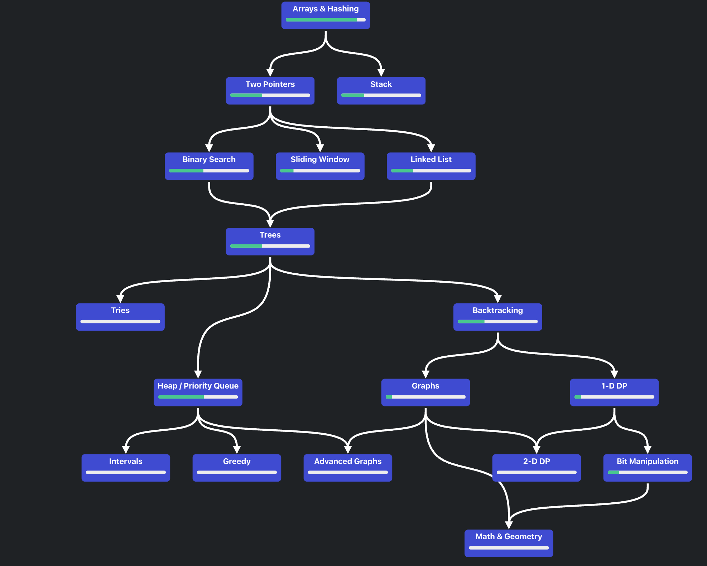

# PYTHON 
This guide is a collection of Python code snippets that cover the basics of the language. It is intended to be a quick reference for anyone who is new to Python or needs a refresher.

# Road Map Algorithm To learn 

This is my developer repository account please gothrough it.

Python Applications: Data Structures Algorithm 

Deployment an application by Containerization software deployment process that bundles an application's code with all the files and libraries it needs to run on any infrastructure. 

KUBERNETES COMMANDS 
[Kubernetes Cmd.pdf](https://github.com/user-attachments/files/19623834/Kubernetes.Cmd.pdf)

Data Structure Algorithm 
LinkedLIst
